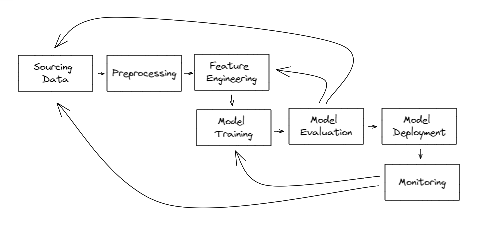

# Machine Learning Operations

This repository was created to follow [Machine Learning & Deep Learning Model Deployment](https://gympass.udemy.com/course/machine-learning-deep-learning-model-deployment/) course.

Its main objective is to show how to create a simple API ([Flask](https://flask.palletsprojects.com/en/)) that receives different inputs and runs models trained with different frameworks ([sklearn](https://scikit-learn.org/stable/), [pytorch](https://pytorch.org/), [tensorflow](https://www.tensorflow.org/)). It also briefly discuss different strategies for model deployment, and the different formats created by different frameworks that can be interchanged using [ONNX](https://onnx.ai/).

It also gave a brief introduction to [MLFlow](https://mlflow.org/) and its use cases.

## Main Concepts

Machine Learning Operations, or MLOps, merges concepts from Developement Operations (DevOps) with challenges related to productionizing models. These include, but are not limited to diagram below:



## Running an example

To run this project, please follow the [poetry installation guide](https://python-poetry.org/docs/), then run `poetry install`.

### Download Data

Here a Kaggle Dataset was used. Before running the command below, please follow [How to Use Kaggle](https://www.kaggle.com/docs/api).

```bash
mkdir data # already present, but empty
poetry run kaggle datasets download -d uciml/red-wine-quality-cortez-et-al-2009 -p data/ --unzip
```

### Models

Models are saved under the models folder, but none are being versioned. MLFlow, quickly discussed [below](#mlflow), does an outstanding job at it, and saves its runs under [mlruns](mlruns/), which is also not being versioned.

#### `LinearRegression`

The last step to make a model available is to make it answer to an API endpoint. Here an endpoint (`/train`) was created to train a `LinearRegression` on a fixed [dataset](#download-data), described above.

Improvements, such as enabling this endpoint to receive which type of model to be trained and on which dataset as parameters, are suggested under the [TODOs improvements](#todo-tree-with-improvements).

`/train` returns a json that can contain evaluation metrics for the model in question - in this case `R2` -, enabling the service that called the train process to know the end performance of the trained model.

Below there is an example of how to invoke `/train`

```bash
curl localhost:8000/train
# {"r2":0.36}
```

Moreover, there is also an endpoint dedicated to returning what the prediction. This request to get the prediction of the `LinearRegression` trained above is shown below:

```bash
curl -d '{"fixed acidity": 7.4,"volatile acidity": 0.7,"citric acid": 0.0,"residual sugar": 1.9,"chlorides": 0.076,"free sulfur dioxide": 11.0,"total sulfur dioxide": 34.0,"density": 0.9978,"pH": 3.51,"sulphates": 0.56,"alcohol": 9.4}'  -H "Content-Type: application/json" -X POST localhost:8000/predict
{"quality":5.06}
```

#### PyTorch

The process for serving a deep learning model, in a limited context, is the same as it is for a simpler model, such as the [linear regression](#linearregression) discusses above.

However, instead of making an endpoint available for training, it was opted to use a simple script that builds the network and trains it. Therefore, the current solution does not consider different architectures. It also does not tackles any challenges related to training or how computationally expensive it is to run a deep learning model.

The code below shows how to invoke training and how to extract a prediction from this model.

```bash
poetry run python mlops/eg/pytorch.py # creates models/dense and trains it
curl -d '{"fixed acidity": 7.4,"volatile acidity": 0.7,"citric acid": 0.0,"residual sugar": 1.9,"chlorides": 0.076,"free sulfur dioxide": 11.0,"total sulfur dioxide": 34.0,"density": 0.9978,"pH": 3.51,"sulphates": 0.56,"alcohol": 9.4}'  -H "Content-Type: application/json" -X POST localhost:8000/predict_net # uses pytorch model to make prediction 
# {"quality":5.15}
```

#### Tensorflow

Following the example [above](#pytorch), a tensorflow solution was also considered. Because of technical difficulties with the local environment (tensorflow has some depencies that depended on Windows C++, which could not be installed), the script exists in [tf.py](/mlops/eg/tf.py), but was not tested and will not be explroed here.

Besides that, an advantage of Tensorflow is that it also has an implementation using JavaScript (tensorflow.js) which enables it to be run on the edge. A simple example of this can be seen in [tf.html](/mlops/eg/tf.html). This examples explores importing the librarie and executing a single prediction of a fixed data point.

#### MLFlow

Many of the TODOs have been well solved by MLFlow, and following its [tutorial](https://mlflow.org/docs/latest/tutorials-and-examples/index.html) is highly advised.

Due to an issue with [`poetry`](https://github.com/python-poetry/poetry/issues/697), this must be installed directly with `pip pip install mlflow`

```bash
poetry run python mlops/eg/tracking.py
poetry run mlflow # to see the logged runs
```

## TODO Tree with Improvements

```bash
└─ mlops
   ├─ eg
   │  ├─ pytorch.py
   │  │  ├─ line 42: FIXME sklearn Create a pipe with MinMaxScaler
   │  │  ├─ line 49: TODO use pytorch lightning
   │  │  ├─ line 51: FIXME allow for different optmizers
   │  │  ├─ line 52: FIXME allow different learning rates
   │  │  ├─ line 101: FIXME abstract load and train test split
   │  │  ├─ line 110: FIXME allow changing batch size
   │  │  └─ line 117: FIXME allow changing epochs
   │  ├─ tf.html
   │  │  └─ line 13: FIXME allow receivng the values from the webpage
   │  └─ tf.py
   │     ├─ line 34: FIXME does tf models work on a pipeline?
   │     └─ line 39: FIXME is tf compatible with pipe.score?
   └─ rest.py
      ├─ line 14: TODO allow other name for models folder
      ├─ line 21: TODO receive data file
      ├─ line 26: TODO receive train test split qtd
      ├─ line 35: TODO receive model name
      ├─ line 37: TODO create train and evaluate abstraction
      ├─ line 38: TODO allow classification
      ├─ line 43: TODO abstract model saving
      ├─ line 46: TODO better unique model naming
      ├─ line 47: TODO store which features were used for the model to make sure prediction is done correctly
      ├─ line 65: TODO receive which model to be used
      ├─ line 66: TODO batch prediction
      ├─ line 68: TODO abstract model loading
      ├─ line 70: FIXME consider other models
      ├─ line 87: FIXME check data that is coming in (related to data that was used to train the model)
      ├─ line 102: FIXME is it needed to transform dict into DataFrame?
      └─ line 118: FIXME debug=True for development
```
